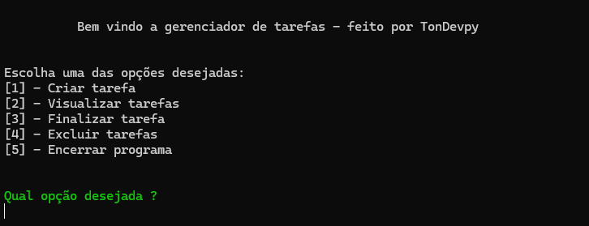

# Gerenciador de Tarefas

  

Este é um gerenciador de tarefas simples desenvolvido em Python. Ele permite que você crie, visualize, finalize e exclua tarefas, mantendo-as organizadas em um arquivo de texto.

## Funcionalidades

1. **Criar Tarefa**: Adiciona uma nova tarefa ao arquivo `tarefas.txt` com o status "Não Concluída".
2. **Visualizar Tarefas**: Exibe todas as tarefas armazenadas no arquivo `tarefas.txt`.
3. **Finalizar Tarefa**: Marca uma tarefa como "Finalizada".
4. **Excluir Tarefa**: Remove uma tarefa do arquivo `tarefas.txt`.

## Exemplo de Uso

**Criar Tarefa:**
Informe o nome da tarefa quando solicitado.
A tarefa será adicionada com o status "Não Concluída".

**Visualizar Tarefas:**
O programa exibirá todas as tarefas listadas no arquivo tarefas.txt.

**Finalizar Tarefa:**
Informe o nome da tarefa que deseja finalizar.
O status da tarefa será alterado para "Finalizada".

**Excluir Tarefa:**
Informe o nome da tarefa que deseja excluir.
A tarefa será removida do arquivo tarefas.txt.